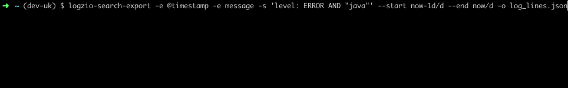

# logzio-search-export

> CLI to export/dump a search result from Logz.io up to millions of log entries



This CLI uses Logz.io's scroll API to export a search in batches of 1000. It can write to a file or pipe to stdout for
further processing.

## Install

Make sure you have node + npm installed (e.g. `brew install node`)

```
npm install -g logzio-search-export
```

To run without installing globally:

```
npx logzio-search-export <see usage>
```

## Usage

```
$ export LOGZIO_API_TOKEN=<token>
$ export LOGZIO_API_REGION=<region>
$ logzio-search-export --help
Usage: logzio-search-export [options]

Options:
  -t, --api-token <api-token>  Logz.io API token [envvar: LOGZIO_API_TOKEN]
  -r, --region <region>        Logz.io region for account, defaults to eu [envvar: LOGZIO_API_REGION]

  -s, --search <search>        A simple search term. For more complex queries pipe in via stdin.
  -e, --extract <extract>      log entry fields to extract in output (can be provided multiple times) (default: all fields are returned) (default: [])
  --start <start-time>         A Logz,io compatible query start time (default: "now-5m")
  --end <end-time>             A Logz.io compatible end time (default: "now")

  -f, --format <format>        output format [json, csv] (default: "json")
  -o, --output <output>        output file to write results to (default: stdout)

  -v, --verbose                print verbose output
  -h, --help                   display help for command
```

## Examples

#### Simple example

- extracting the @timestamp and message fields
- query string for java errors
- a date range for yesterday
- an output file to write to

```shell script
logzio-search-export -e @timestamp -e message -s 'level: ERROR AND "java"' --start now-1d/d --end now/d -o log_lines.json
```

#### Stdout example

Note: Piping to stdout to a file is slower than using the `-o` flag

```shell script
# To a file
logzio-search-export -e message -s 'level: ERROR AND "java"' > log_lines.json
# Or to another program
logzio-search-export -e message -s 'level: ERROR AND "java"' | jq .
```

#### Complex query example

- extracting the @timestamp and message fields
- output to log lines
- query.json is a file that contains an [elastic search query JSON][1]

```shell script
echo "{ ... }" > query.json
logzio-search-export -e @timestamp -e message -o log_lines.json < query.json
```

#### CSV example

```shell script
logzio-search-export --format csv -o log_lines.csv < query.json
```

#### Minimalistic example

Will retain all fields on the log entry (quite a lot of data)

```shell script
logzio-search-export -o log_lines.json < query.json
```


#### Different regions

Your account is limited to one [Logz.io region][2] so make sure you're selecting one of:

- `eu` (default): app-eu.logz.io
- `us`: app.logz.io
- `au`: app-au.logz.io
- `ca`: app-ca.logz.io
- `nl`: app-nl.logz.io
- `wa`: app-wa.logz.io

You can export the `LOGZIO_API_REGION` environment variable to not have to provide the `--region` flag on each run.


[1]: https://www.elastic.co/guide/en/elasticsearch/reference/current/query-dsl.html
[2]: https://docs.logz.io/user-guide/accounts/account-region.html
